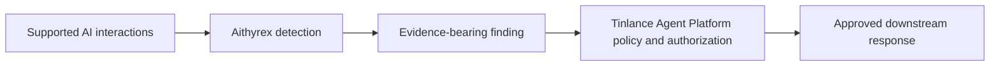

<p align="center">
  <strong>Aithyrex</strong><br />
  <em>Agentic AI Runtime Security — AI can act. Aithyrex watches.</em>
</p>

<p align="center">
  <a href="https://github.com/LloydCoder/Aithyrex/actions/workflows/ci.yml"></a>
  <a href="https://github.com/LloydCoder/Aithyrex/actions/workflows/security-scan.yml"></a>
  
  
</p>

Aithyrex is Tinlance’s AI-interaction threat detection service. It inspects supported LLM prompts, completions and related telemetry for suspicious patterns, then emits findings with provenance for downstream policy and response systems.

> **Release status: BLOCKED.** Independent AI-text effectiveness evaluation, independent security review, controlled production deployment and rollback, backup/restore, measured SLOs and authorized legal/compliance review remain open. See [Release readiness](docs/assurance/RELEASE_READINESS.md).

## What Aithyrex does

- Inspects supported AI interactions and related telemetry for suspicious patterns.
- Emits versioned findings and detector evidence for downstream systems.
- Provides API, SDK and framework integration surfaces present in the repository.
- Includes offline synthetic red-team regression tests and security-oriented CI checks.

A detection is a signal, not proof of malicious intent and not an authorization grant. Effectiveness and false-positive claims require representative, independently labeled evaluation data.

## Architectural boundary



| System | Responsibility |
|---|---|
| **Aithyrex** | AI-interaction threat detection, telemetry enrichment and findings |
| **Tinlance Agent Platform** | Authoritative identity, tenant binding, authorization, policy, approvals, governed execution, sandboxing, secrets, budgets and authoritative audit/evidence |
| **Auctaryn** | Agent context, memory, skills and proposed-action risk assessment |
| **ThreatFade** | Separately operated behavioral/network detection; its network metrics do not validate AI-text detection |
| **AURONTRA** | IT resilience and incident/ticket workflows |
| **FusionOps** | Response workflow orchestration |
| **KalevioAI** | Compliance evidence/reporting workflows; an export is not proof of legal filing |
| **TSIC / TADL** | Cross-repository conformance contracts and developer-artifact/schema validation |

Aithyrex must not create a competing identity, policy, approval or execution authority. Enforcement requests must be evaluated by the authoritative Platform at the actual execution boundary.

## Quickstart

Requirements: Python 3.12+, Docker with the Compose plugin, and a working Docker daemon. These commands configure a **local development environment only**.

```bash
python -m venv .venv
source .venv/bin/activate
python -m pip install -r backend/requirements.txt
cp .env.example .env
docker compose up --build
```

When the stack is healthy, check liveness at `http://127.0.0.1:8002/health/live` (for example, with `curl --fail http://127.0.0.1:8002/health/live`). Stop the stack with `docker compose down`. Local Compose defaults and placeholder credentials are not suitable for production. Do not expose this stack to a public network or reuse its secrets in deployed environments.

## Installation and development

For local Python development, install runtime requirements from `backend/requirements.txt`. `pyproject.toml` defines the `aithyrex` package and optional `server`, provider-integration and `dev` extras. Review those extras before choosing an installation profile.

Useful checks from the repository root:

```bash
pytest backend/tests/unit/ -v --tb=short
pytest backend/tests/integration/ -v --tb=short
ruff check backend/
bandit -r backend/ -ll -x backend/tests/
python -m backend.evaluation.red_team_suite
```

The offline red-team suite uses a synthetic regression corpus. Passing it does not establish real-world detection accuracy or approve a release.

## Configuration

Copy `.env.example` to `.env` for local development. Never commit `.env` or production secrets.

| Variable | Purpose | Guidance |
|---|---|---|
| `APP_ENV` | Runtime environment | Use `development` only for local work; production validation is stricter |
| `APP_SECRET_KEY` | Application secret | Replace the placeholder with a securely generated secret outside source control |
| `DATABASE_URL` | PostgreSQL connection | Compose supplies a local-development connection inside its container network |
| `REDIS_URL` | Redis connection | Compose supplies a local-development connection inside its container network |
| `CLERK_SECRET_KEY`, `CLERK_JWT_KEY`, `CLERK_JWT_ISSUER` | Authentication verification | Configure valid trust anchors and issuer; do not enable insecure fallback in production |
| `THREATFADE_API_URL`, `THREATFADE_API_KEY` | Optional ThreatFade integration | Keep unavailable/degraded telemetry explicit; never interpret failure as a safe result |
| `OUTBOX_WORKER_ENABLED` | Durable delivery worker | Required by production configuration checks |

See [`.env.example`](.env.example), [Operations Runbook](docs/OPERATIONS.md) and the [Threat Model](docs/assurance/THREAT_MODEL.md) for the full configuration and failure semantics.

## Features and assurance status

| Area | Repository evidence | Limitation |
|---|---|---|
| Detection | Detector modules and API routes under `backend/` | Real-world effectiveness is not established by code presence or synthetic tests |
| Authentication and tenancy | Clerk JWT validation and tenant-scoped paths | Deployment-specific configuration and cross-tenant verification remain essential |
| Integrations | SDK and gateway contracts | Support varies by provider/version and tested path; see the [integration contract](docs/SDK_GATEWAY_CONTRACT.md) |
| SIEM/compliance exports | Delivery and reporting modules | Exporting evidence does not perform legal assessment or file a regulatory report |
| Operations | Health probes, outbox and operational guidance | Production deployment, restore drill and measured SLO evidence are not recorded as passed |
| Release assurance | Fail-closed release manifest and evaluator | Release remains blocked until all required gates have valid evidence |

## Documentation

- [Architecture and founding-spec reconciliation](docs/FOUNDING_SPEC_RECONCILIATION.md)
- [Operations runbook](docs/OPERATIONS.md)
- [Threat model](docs/assurance/THREAT_MODEL.md)
- [Release readiness and controlled launch](docs/assurance/RELEASE_READINESS.md)
- [Independent review protocol](docs/assurance/INDEPENDENT_REVIEW_PROTOCOL.md)
- [Billing webhook security](docs/BILLING_WEBHOOK_SECURITY.md)
- [SDK and gateway integration contract](docs/SDK_GATEWAY_CONTRACT.md)
- [TSIC conformance](docs/TSIC_CONFORMANCE.md)
- [Synthetic red-team evaluation](docs/RED_TEAM_EVALUATION.md)
- [Repository maintenance checklist](docs/REPOSITORY_MAINTENANCE.md)

## Contributing

Read [CONTRIBUTING.md](CONTRIBUTING.md), follow the [Code of Conduct](CODE_OF_CONDUCT.md), and use the issue and pull-request templates. Do not include secrets, raw customer prompts/completions, tokens or personal data in public issues and test fixtures. Report vulnerabilities privately using [SECURITY.md](SECURITY.md).

## License

Aithyrex is intended to be distributed under Apache License 2.0 as represented by the repository's [LICENSE](LICENSE) file and package metadata. The license file is authoritative; no additional or dual license is implied.

---

Built by Tinlance Limited. Aithyrex is a detection component in a wider security architecture, not an independent policy or execution authority.
